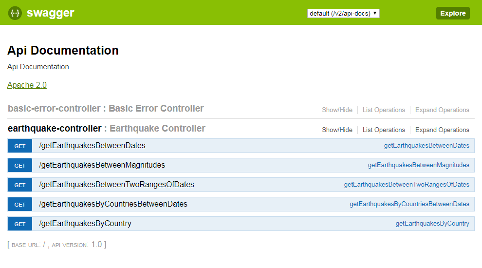

# Global Logic Challenge Resolution

> This project is for my application to Global Logic. 
>
> To be able to build and run this project, you must have Gradle installed in your system (for more details on how to install Gradle, visit  https://gradle.org/install/).

When you have gradle installed, you will be able to deploy the Spring Boot project just by executing the command:

`gradle bootRun`

at the project's directory, when the compilation and deployment finishes, you may go to  http://localhost:8085/swagger-ui.html where you will be able to test each one of the endpoints.

## Notes

- Each method was created as GET, because there was no mention about this topic at the challenge.
- Spock tests are not finished, there is just one dummy test.
- Countries JSON file source is: https://gist.github.com/sindresorhus/1341699